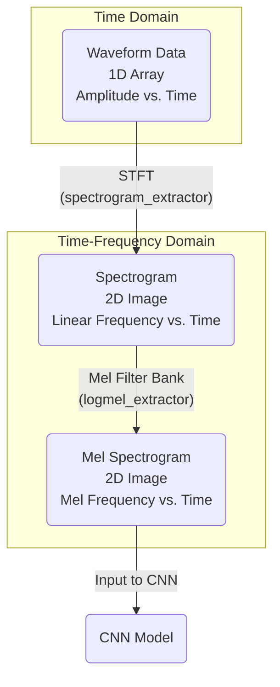

# GTZAN Music Genre Classification with PANNs Transfer Learning

Music genre classification using fine-tuned Pretrained Audio Neural Networks (PANNs) on the GTZAN dataset. This project also includes emotion analysis capabilities.

## Main Functions

This project provides three main capabilities:

### 1. 🎵 Music Genre Classification (`run_music_full_pipeline.sh`)
Full pipeline for classifying music into 10 genres using GTZAN dataset with transfer learning from pretrained PANNs.

### 2. 😊 Emotion Analysis (`run_emotion.sh`) 
Train models to predict valence and arousal from audio using CNN-based regression models.

### 3. 🔄 Emotion with Feedback (`run_emotion_feedback.sh`)
Advanced emotion analysis with Long Range Modulation (LRM) feedback system for multi-pass inference and steering.

## Project Structure

```
my_panns_transfer_to_gtzan/
├── src/                          # Main source code
│   ├── models/                   # Neural network models
│   │   ├── __init__.py
│   │   ├── cnn_models.py         # CNN-based models (Cnn6, Cnn14)
│   │   ├── emotion_models.py     # Emotion regression models
│   │   └── losses.py             # Loss functions
│   ├── data/                     # Data processing
│   │   ├── __init__.py
│   │   ├── data_generator.py     # Data loading and batching
│   │   ├── feature_extractor.py  # Audio feature extraction
│   │   └── dataset_utils.py      # Dataset utilities
│   ├── training/                 # Training scripts
│   │   ├── __init__.py
│   │   ├── trainer.py            # Main training loop
│   │   ├── evaluator.py          # Model evaluation
│   │   └── config.py             # Training configuration
│   └── utils/                    # Utility functions
│       ├── __init__.py
│       ├── audio_utils.py        # Audio processing utilities
│       └── visualization.py      # Plotting and visualization
├── scripts/                      # Executable scripts
│   ├── train.py                  # Main training script
│   ├── evaluate.py               # Model evaluation script
│   ├── extract_features.py       # Feature extraction script
│   └── test_models.py            # Model testing script
├── examples/                     # Example usage scripts
│   ├── emotion_example.py        # Emotion analysis example
│   └── genre_classification.py   # Genre classification example
├── configs/                      # Configuration files
│   ├── model_configs.py          # Model configurations
│   └── training_configs.py       # Training configurations
├── tests/                        # Test files
│   ├── test_data_split.py        # Data splitting tests
│   └── test_emotion_evaluation.py # Emotion evaluation tests
├── docs/                         # Documentation
│   └── Mel_Spectrogram_Technical_Guide.pdf
├── shell_scripts/                # Shell scripts
│   ├── run_music_full_pipeline.sh # Full music genre classification pipeline
│   ├── run_emotion.sh            # Emotion analysis training
│   ├── run_emotion_feedback.sh   # Emotion analysis with feedback
│   ├── setup_environment.sh      # Environment setup script
│   ├── sync_to_remote.sh         # Remote sync script
│   └── sync_logs_from_remote.sh  # Log sync script
├── requirements.txt              # Python dependencies
└── README.md                     # This file
```

## Dataset

The GTZAN dataset contains 1000 30-second audio clips across 10 genres:
- blues, classical, country, disco, hiphop, jazz, metal, pop, reggae, rock

Download from: http://marsyas.info/downloads/datasets.html

Expected structure:
```
dataset_root/
├── blues (100 files)
├── classical (100 files)
├── country (100 files)
├── disco (100 files)
├── hiphop (100 files)
├── jazz (100 files)
├── metal (100 files)
├── pop (100 files)
├── reggae (100 files)
└── rock (100 files)
```

## Quick Start

### 1. Setup Environment
```bash
# Create virtual environment
python -m venv venv
source venv/bin/activate  # On Windows: venv\Scripts\activate

# Install dependencies
pip install -r requirements.txt
```

### 2. Test the Installation
```bash
# Test all models work correctly
PYTHONPATH=. python scripts/test_models.py

# Test emotion models
PYTHONPATH=. python examples/emotion_example.py
```

## Usage Instructions

### 🎵 Music Genre Classification Pipeline

**Full automated pipeline for GTZAN genre classification:**

```bash
# Run the complete music genre classification pipeline
bash shell_scripts/run_music_full_pipeline.sh
```

**What this does:**
1. Feature extraction from GTZAN audio files
2. Dataset validation and completeness check
3. Train/validation split (70/30)
4. Model training with transfer learning from pretrained PANNs
5. Results saved to workspace directory

**Manual step-by-step:**
```bash
# Extract features
PYTHONPATH=. python scripts/extract_features.py --dataset_dir /path/to/gtzan --workspace ./workspace

# Train model
PYTHONPATH=. python scripts/train.py --dataset_dir /path/to/gtzan --workspace ./workspace --model_type Transfer_Cnn14

# Evaluate model
PYTHONPATH=. python scripts/evaluate.py --checkpoint_path ./workspace/checkpoints/model.pth --dataset_dir /path/to/gtzan
```

### 😊 Emotion Analysis Training

**Train emotion regression models for valence/arousal prediction:**

```bash
# Run emotion analysis training
bash shell_scripts/run_emotion.sh
```

**What this does:**
1. Trains `FeatureEmotionRegression_Cnn6` (mel-spectrogram input)
2. Trains `EmotionRegression_Cnn6` (raw waveform input)
3. Predicts valence and arousal values from audio

**Manual training:**
```bash
# Train emotion model with mel-spectrogram input
PYTHONPATH=. python scripts/train.py --model_type FeatureEmotionRegression_Cnn6 --dataset_dir /path/to/emotion_data

# Train emotion model with waveform input  
PYTHONPATH=. python scripts/train.py --model_type EmotionRegression_Cnn6 --dataset_dir /path/to/emotion_data
```

### 🔄 Emotion Analysis with Feedback

**Advanced emotion analysis with Long Range Modulation (LRM) feedback system:**

```bash
# Run emotion analysis with feedback
bash shell_scripts/run_emotion_feedback.sh
```

**What this does:**
1. Trains `FeatureEmotionRegression_Cnn6_LRM` model
2. Implements multi-pass inference with feedback loops
3. Supports external feedback and steering signals
4. Enables real-time emotion modulation

**Features:**
- Multi-pass inference (2+ forward passes)
- External feedback injection
- Steering signal support
- Dynamic modulation strength control
- Active connection management

## Models

### Genre Classification Models
- **Transfer_Cnn14**: 14-layer CNN with transfer learning from pretrained PANNs
- **Transfer_Cnn6**: 6-layer CNN with transfer learning
- **FeatureAffectiveCnn6**: Cnn6 with affective system for emotion analysis

### Emotion Analysis Models
- **FeatureEmotionRegression_Cnn6**: Mel-spectrogram to valence/arousal regression
- **EmotionRegression_Cnn6**: Raw waveform to valence/arousal regression
- **FeatureEmotionRegression_Cnn6_LRM**: Advanced emotion model with Long Range Modulation feedback

## Feature Extraction Pipeline

The project converts raw audio to Mel Spectrograms for CNN processing:



### Processing Details
1. **Waveform**: Raw audio resampled to 32kHz, truncated to 30 seconds
2. **Spectrogram**: STFT creates 2D time-frequency representation
3. **Mel Spectrogram**: Frequency axis converted to Mel scale for human hearing perception

## Results

### Music Genre Classification
- **Training time**: ~30 minutes (Tesla V100 GPU)
- **Validation accuracy**: ~89% (fold-dependent)
- **Model convergence**: ~2000 iterations

### Emotion Analysis
- **Input**: 30-second audio clips
- **Output**: Valence (-1 to 1) and Arousal (-1 to 1) values
- **Model size**: ~5.9M parameters per model

## Citation

Kong, Qiuqiang, et al. "PANNs: Large-scale pretrained audio neural networks for audio pattern recognition." arXiv preprint arXiv:1912.10211 (2019).
