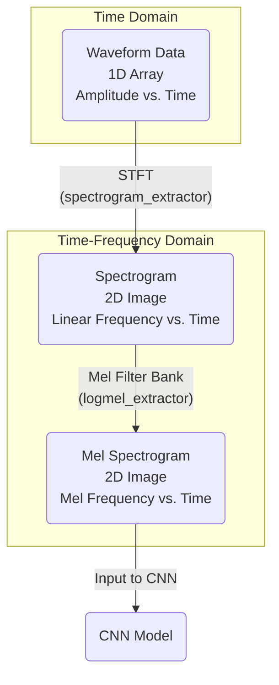

# GTZAN classification finetuned on pretrained audio neural networks (PANNs)

Music genre classification is a task to classify audio clips into genres such as jazz, classical, etc. GTZAN is a music genre dataset containing 1000 30-second audio clips with 10 genres. In this codebase, we fine-tune PANNs [1] to build music classification systems.

## Dataset
The dataset can be downloaded from http://marsyas.info/downloads/datasets.html

## Run the code

**0. Prepare data** 

Download and upzip data, the data looks like:

<pre>
dataset_root
├── blues (100 files)
├── classical (100 files)
├── country (100 files)
├── disco (100 files)
├── hiphop (100 files)
├── jazz (100 files)
├── metal (100 files)
├── pop (100 files)
├── reggae (100 files)
└── rock (100 files)
</pre>

**1. Requirements** 

python 3.6 + pytorch 1.0

**2. Then simply run:**

$ Run the bash script ./runme.sh

Or run the commands in runme.sh line by line. The commands includes:

(1) Modify the paths of dataset and your workspace

(2) Extract features

(3) Train model

## Model
A 14-layer CNN of PANNs is fine-tuned. We use 10-fold cross validation for GTZAN classification. That is, 900 audio clips are used for training, and 100 audio clips are used for validation.

## Feature Extraction Pipeline
The core of this project involves converting raw audio into a format that a Convolutional Neural Network (CNN) can process effectively. This is done by transforming the 1D audio waveform into a 2D image-like representation called a Mel Spectrogram.

### 1. Waveform Data
This is the most direct representation of audio, showing amplitude (sound pressure) over time. In this project, all audio is resampled to 32,000 Hz and truncated to 30-second clips.
- **Domain**: Time
- **Representation**: 1D array of amplitude values.

### 2. Spectrogram
To make frequency information visible, the waveform is converted into a spectrogram using a Short-Time Fourier Transform (STFT). This creates a 2D plot showing the intensity of different frequencies over time. This is why CNNs are effective—they can treat this representation as an image.
- **Domain**: Time-Frequency
- **Representation**: 2D matrix with a linear frequency scale.

### 3. Mel Spectrogram
This is a refinement of the spectrogram. The frequency axis is converted to the **Mel scale**, which mimics how humans perceive pitch. We are more sensitive to changes in low frequencies than high ones. This representation emphasizes the most relevant frequency information for tasks like music and speech recognition, often leading to better model performance. The models in this project use Log-Mel Spectrograms as their direct input.
- **Domain**: Time-Frequency (Mel Scale)
- **Representation**: 2D matrix adapted for human hearing.

## Results
The system takes around 30 minutes to converge with a single card Tesla Tesla-V100 GPU card. Here is the result on 2nd fold. The results on different folds can be different.

<pre>
Namespace(augmentation='mixup', batch_size=32, cuda=True, dataset_dir='/home/tiger/datasets/GTZAN/dataset_root', filename='main', freeze_base=False, holdout_fold='2', learning_rate=0.0001, loss_type='clip_nll', mode='train', model_type='Transfer_Cnn14', pretrained_checkpoint_path='/home/tiger/released_models/sed/Cnn14_mAP=0.431.pth', resume_iteration=0, stop_iteration=10000, workspace='workspaces/panns_transfer_to_gtzan')
Using GPU.
Load pretrained model from /home/tiger/released_models/sed/Cnn14_mAP=0.431.pth
------------------------------------
Iteration: 200
Validate accuracy: 0.780
    Dump statistics to /home/tiger/workspaces/panns_transfer_to_gtzan/statistics/main/holdout_fold=2/Transfer_Cnn14/pretrain=True/loss_type=clip_nll/augmentation=mixup/batch_size=32/freeze_base=False/statistics.pickle
    Dump statistics to /home/tiger/workspaces/panns_transfer_to_gtzan/statistics/main/holdout_fold=2/Transfer_Cnn14/pretrain=True/loss_type=clip_nll/augmentation=mixup/batch_size=32/freeze_base=False/statistics_2020-07-12_16-53-42.pkl
Sun, 12 Jul 2020 16:57:55 main.py[line:165] INFO Train time: 244.052 s, validate time: 3.158 s
------------------------------------
...
------------------------------------
Iteration: 2000
Validate accuracy: 0.890
    Dump statistics to /home/tiger/workspaces/panns_transfer_to_gtzan/statistics/main/holdout_fold=2/Transfer_Cnn14/pretrain=True/loss_type=clip_nll/augmentation=mixup/batch_size=32/freeze_base=False/statistics.pickle
    Dump statistics to /home/tiger/workspaces/panns_transfer_to_gtzan/statistics/main/holdout_fold=2/Transfer_Cnn14/pretrain=True/loss_type=clip_nll/augmentation=mixup/batch_size=32/freeze_base=False/statistics_2020-07-12_16-53-42.pkl
Train time: 234.912 s, validate time: 4.188 s
Model saved to /home/tiger/workspaces/panns_transfer_to_gtzan/checkpoints/main/holdout_fold=2/Transfer_Cnn14/pretrain=True/loss_type=clip_nll/augmentation=mixup/batch_size=32/freeze_base=False/2000_iterations.pth
------------------------------------
...
</pre>

## Citation

[1] Kong, Qiuqiang, Yin Cao, Turab Iqbal, Yuxuan Wang, Wenwu Wang, and Mark D. Plumbley. "PANNs: Large-scale pretrained audio neural networks for audio pattern recognition." arXiv preprint arXiv:1912.10211 (2019).
